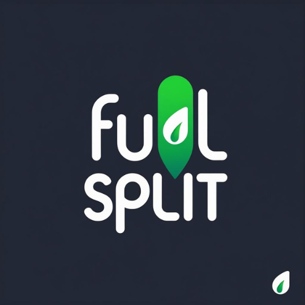

<div align="center">
 
  <h1>FuelSplit</h1>
  <p><b>A smart, elegant Flutter app to track trips, manage passengers, calculate fuel economy, and split expenses effortlessly.</b></p>

  [](https://flutter.dev)
  [](https://firebase.google.com/)
  [](https://dart.dev)
  [](#-license)
</div>

---

## 🌟 Overview

**FuelSplit** is a modern Flutter application designed for vehicle owners, commuters, and road-trippers to effortlessly track trips, refuel logs, vehicle mileage, and passenger fuel cost splits.

Whether you're going on a group road trip with friends or taking a solo drive for personal use, FuelSplit automates cost calculation, passenger debt tracking, location geocoding, and WhatsApp payment reminder dispatching.

---

## ✨ Key Features

### 🚗 Trip Management & Intermediate Stops
* **Shared & Personal Trips:** Choose between **Shared Trips** (cost split with passengers) and **Personal Trips** (100% self-funded, no passenger debt generated).
* **Intermediate Waypoints (Stops):** Add unlimited intermediate stops between your Start Location and Destination.
* **Route Timeline Visualizer:** Interactive 🟢 *Start* -> 🟡 *Stops* -> 🔴 *Destination* timeline displayed on trip details.
* **Trip Type Filter Chips:** Quickly filter trips by **All**, **Shared**, or **Personal** on the home screen.

### 📍 GPS Engine & Auto Distance Calculation
* **Instant GPS Location:** Fetch current GPS location with high-accuracy positioning, timeout protection, and last-known position fallback.
* **Dual-Layer Reverse Geocoding:** Converts GPS coordinates to readable address strings with native geocoding and OpenStreetMap Nominatim fallback.
* **Auto Route Distance:** Auto-calculate actual driving distance (in km) across all route stops using GPS coordinates.

### 👥 Passenger Management & Real-Time Contact Sync
* **Device Contacts Import:** Import crew members directly from your phone's contact list.
* **Real-Time Auto-Sync:** Passenger names automatically update when edited in phone contacts and cascade across all existing trip records, debt summaries, and payments.
* **WhatsApp Payment Receipts:** Send formatted payment reminder receipts directly to passengers via WhatsApp with one tap.

### 💳 Payments & Debt Settlement
* **Unsettled Debts Dashboard:** Real-time stream of all passenger debts.
* **Trip Date & Direct Navigation:** Debt cards display formatted trip dates and support tap-to-navigate directly to the corresponding trip details screen.
* **Payment Status Toggles:** Mark individual passenger shares as paid/unpaid in real time.

### ⛽ Refuel Logs & Mileage Tracking
* **Refuel Log History:** Record manual refuels (fuel volume, cost, odometer, date).
* **Refuel Log Edit & Date Picker:** Edit existing refuel entries and select custom refuel dates.
* **Vehicle Mileage (km/L):** Tracks vehicle fuel efficiency across both shared and personal trips.

### 🔐 Authentication & Security
* **Firebase Authentication:** Email/Password sign-in & Google Sign-In integration.
* **Secure Storage:** Password privacy enforcement without local plaintext credential caching.

---

## 🛠️ Tech Stack

* **Framework:** Flutter 3.8+ (Dart 3)
* **State Management:** Riverpod (`flutter_riverpod`)
* **Routing:** GoRouter (`go_router`) with custom modal and fade transitions
* **Backend:** Firebase Authentication, Cloud Firestore
* **Location & Maps:** Geolocator, Geocoding, OpenStreetMap (Photon API)
* **UI/UX Aesthetics:** Custom Light & Dark Themes, Micro-animations (`flutter_animate`), Google Fonts (`Inter`), Glassmorphism, Haptic Feedback
* **Device APIs:** Device Contacts (`flutter_contacts`), URL Launcher, Permission Handler

---

## 📁 Project Structure

```text
lib/
├── core/
│   ├── router/          # GoRouter configurations and custom page transitions
│   ├── theme/           # App design system, color palette, dark & light themes
│   └── utils/           # Location helper, Contact helper, URL launcher, Firebase utils
└── features/
    ├── auth/            # Sign In, Register, Profile, Google Sign-In
    ├── dashboard/       # Charts, expense statistics, user dashboard
    ├── home/            # Main navigation shell & bottom navigation bar
    ├── passengers/      # Passenger directory, contact auto-sync, cascading updates
    ├── payments/        # Settlement tracking, debt stream, WhatsApp receipts
    └── trips/           # Trip logs, intermediate stops, personal trips, refuel logs
```

---

## ⚙️ Getting Started

### Prerequisites

* [Flutter SDK](https://docs.flutter.dev/get-started/install) (v3.8.0 or higher)
* Android Studio / VS Code with Flutter extension
* Configured Firebase Project

### Installation & Setup

1. **Clone the repository:**
   ```bash
   git clone https://github.com/premshah7/fuel_split.git
   cd fuel_split
   ```

2. **Install Flutter Dependencies:**
   ```bash
   flutter pub get
   ```

3. **Configure Firebase:**
   - **Android:** Place your `google-services.json` in `android/app/`.
   - **iOS:** Place your `GoogleService-Info.plist` in `ios/Runner/`.

4. **Run Code Analysis:**
   ```bash
   flutter analyze
   ```

5. **Run the Application:**
   ```bash
   flutter run
   ```

---

## 🛡️ License

This project is licensed under the MIT License - see the LICENSE file for details.
